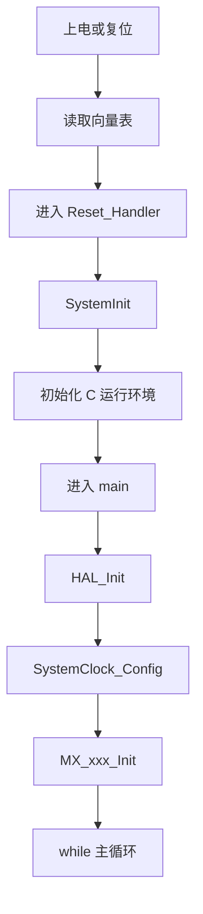

# STM32 体系结构与启动流程

> 能力定位：理解程序为什么能从复位走到 `main()`。
>
> 原始来源：[[01_准备与基础认知]]。

---

## 本节目标

- 能画出 Cortex-M3、Flash、SRAM 和片上外设关系
- 能按顺序解释 Reset_Handler 到 while(1)
- 能说明向量表、启动文件、链接脚本和系统文件各自作用

## 核心概念

### 知识地图

| 名词 | 工程含义 |
|---|---|
| Cortex-M3 | 执行指令、异常和中断管理的内核 |
| Flash | 保存代码和只读数据 |
| SRAM | 保存栈、堆和运行期变量 |
| 内存映射 | 用统一地址空间访问存储器和外设寄存器 |
| 向量表 | 保存初始栈顶和异常/中断入口 |

### STM32 是什么

STM32 可以理解为：Cortex-M 内核 + Flash/SRAM + 时钟复位系统 + GPIO、TIM、ADC、USART 等片上外设。HAL 不是硬件本身，而是对寄存器操作的工程封装。

### 启动流程

```text
上电或复位
-> 从向量表读取初始栈顶地址
-> 跳转 Reset_Handler
-> SystemInit 配置基础系统环境
-> 初始化 C 运行环境（数据段 / BSS）
-> 进入 main
-> HAL_Init
-> SystemClock_Config
-> MX_xxx_Init
-> 主循环
```

#### 启动流程图



### 三个容易混淆的文件

| 对象 | 作用 |
|---|---|
| 启动文件 | 提供向量表、Reset_Handler 和默认中断入口 |
| 链接脚本 / Scatter 文件 | 决定代码、常量和变量放到 Flash/SRAM 的位置 |
| 向量表 | 保存初始栈地址和各异常/中断入口地址 |

这里保持概念级说明，不展开具体启动汇编指令。

### HAL 工程中的入口

- `HAL_Init()`：初始化 HAL 基础设施和默认时基。
- `SystemClock_Config()`：配置系统和总线时钟。
- `MX_xxx_Init()`：配置各外设实例。
- `while (1)`：应用层持续运行入口。

## 本质理解

MCU 上电后不会直接“运行 main”。内核先从固定位置取得栈顶和复位入口，启动代码建立 C 语言运行环境，之后才进入 main。理解这条链路可以把启动失败、HardFault、时钟失败和业务死循环分开。


## STM32F103 / HAL 中的实现方式

- STM32F103 的外设寄存器通过内存映射进入 Cortex-M3 地址空间，HAL 最终仍是读写这些寄存器。
- 启动文件提供向量表和弱定义中断入口；链接脚本决定代码、数据、栈等放置位置。
- `system_stm32f1xx.c` 中的系统初始化负责基础时钟/向量相关准备，CubeMX 在 main 中生成 HAL 和外设初始化顺序。

## CubeMX 配置要点

1. 选择准确器件，确认 Flash/SRAM 容量。
2. 配置 SYS Debug、RCC 和 Clock Configuration。
3. 生成工程后查看 startup、system、main 和链接配置文件。
4. 在 `main`、`SystemClock_Config`、`MX_GPIO_Init` 设置断点观察启动顺序。

## HAL / CMSIS / CubeMX 相关接口

### API 速查

| 接口 | 类型 | 解决什么问题 | 常见调用位置 |
|---|---|---|---|
| `HAL_Init()` | HAL API | 初始化 HAL 状态、默认 tick 和基础中断配置 | `main()` 入口 |
| `SystemCoreClockUpdate()` | CMSIS 系统函数，非 HAL API | 按当前 RCC 配置刷新 `SystemCoreClock` | 手动改时钟后 |
| `HAL_GetTick()` | HAL API | 获取毫秒时基 | 超时和任务节拍 |
| `NVIC_SystemReset()` | CMSIS 内核接口，非 HAL API | 请求系统复位 | 受控故障恢复 |

### 使用注意

| 接口 | 前置条件 | 返回值 / 阻塞 | 常见坑 |
|---|---|---|---|
| `HAL_Init()` | C 运行环境已准备 | 返回 `HAL_StatusTypeDef`；同步初始化 | 与 `SystemInit()` 或外设 `MX_Init` 混淆 |
| `SystemCoreClockUpdate()` | RCC 配置已稳定 | `void`；同步计算 | 只改时钟寄存器却不更新变量，延时/换算错误 |
| `HAL_GetTick()` | HAL tick 正常运行 | 返回 `uint32_t`；非阻塞 | 在 tick 停止时仍依赖它做超时 |
| `NVIC_SystemReset()` | 关键数据已安全处理 | 不返回；触发复位 | 在未保存状态时直接复位；把复位当故障根治 |

### 典型调用顺序

```text
上电/复位
-> 向量表取得 MSP 和 Reset_Handler
-> SystemInit()（CMSIS 系统层）
-> C 运行环境初始化
-> main()
-> HAL_Init()
-> SystemClock_Config()
-> MX_xxx_Init()
-> Start/Receive API
```

### 什么时候用哪个接口？

| 场景 | 推荐接口 |
|---|---|
| HAL 工程入口初始化 | `HAL_Init()` |
| 手工修改系统时钟后更新频率变量 | `SystemCoreClockUpdate()` |
| 普通超时 | `HAL_GetTick()` |
| 无法恢复且已完成安全处理 | `NVIC_SystemReset()` |

## 启动顺序骨架

> 代码性质：示例框架，用于理解调用顺序，不能保证直接编译。
> 验证状态：未上板验证，需按 CubeMX 变量名、开发板原理图和课程源码核对。

```c
int main(void)
{
    HAL_Init();
    SystemClock_Config();
    MX_GPIO_Init();

    while (1)
    {
        App_Task();
    }
}
```

## 调试方法

程序不运行时，依次确认是否进入 `Reset_Handler`、`main()`、时钟配置和外设初始化。HardFault、时钟失败和 BOOT0 状态应分开排查。

```text
确认 BOOT0 与启动来源
-> 在 Reset_Handler 或 main 断点
-> 确认栈指针和向量表位置合理
-> 单步通过 HAL_Init
-> 检查 SystemClock_Config 是否进入 Error_Handler
-> 逐个启用 MX_xxx_Init
-> 最后运行主循环
```

## 常见坑

| 现象 | 常见原因 | 处理方法 |
|---|---|---|
| 复位后不进 main | 启动来源或向量表错误 | 检查 BOOT0、Flash 和启动文件 |
| 进入 Error_Handler | 时钟配置失败 | 核对晶振和 Clock Configuration |
| 全局变量异常 | C 运行环境或越界写损坏 | 检查链接区域和内存越界 |
| 中断跳错位置 | 向量表/函数名不匹配 | 核对 startup 中 IRQ 名称 |
| 栈溢出 | 局部数组或递归过大 | 缩小局部对象并检查栈大小 |

## 与其它章节的关系

- [[RCC时钟树]] 负责启动后的系统时钟。
- [[NVIC_EXTI_SysTick]] 解释向量表和异常入口。
- [[工具链与开发环境]] 负责构建和下载这套固件。

## 复习检查清单

- [ ] 能说明 Cortex-M3、Flash、SRAM 和片上外设之间的关系。
- [ ] 能按复位、向量表、`Reset_Handler`、C 运行环境和 `main()` 顺序解释启动过程。
- [ ] 能区分启动文件、向量表、系统文件和链接脚本的职责。
- [ ] 能解释 `HAL_Init()`、`SystemClock_Config()`、`MX_xxx_Init()` 的调用位置。
- [ ] 能从 BOOT0、复位入口、时钟配置和外设初始化逐层定位“不进主循环”。
- [ ] 能说明 `SystemCoreClockUpdate()` 和 `NVIC_SystemReset()` 属于 CMSIS 而非 HAL。
- [ ] 能指出 HardFault、时钟失败和业务死循环需要使用不同证据排查。
