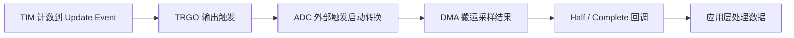

# TIM 触发 ADC

> 能力定位：用硬件事件建立稳定采样节拍，减少软件延时抖动。
>
> 原始来源：[[07_TIM触发ADC采集]]。
---
## 本节目标

- 能区分软件触发和硬件触发 ADC
- 能配置 TIM TRGO -> ADC 外部触发链
- 能按正确顺序启动并定位 Poll 卡死

## 核心概念

### 知识地图

| 名词 | 工程含义 |
|---|---|
| TRGO | 定时器向其他外设输出的触发信号 |
| Update Event | 常用 TRGO 来源 |
| External Trigger | ADC 转换启动条件 |
| 采样抖动 | 触发时间相对理想周期的偏差 |
| 内部温度传感器 | 片上 ADC 通道案例 |

### 三个角色

| 角色 | 作用 |
|---|---|
| TIM | 按固定频率产生 Update Event |
| TRGO | 把 TIM 更新事件输出给其他外设 |
| ADC | 把外部触发作为转换启动条件 |

### 启动顺序

```text
配置 TIM TRGO
-> ADC 选择对应外部触发源
-> 先启动 ADC 等待触发
-> 再启动 TIM
-> ADC 按硬件节拍采样
```

#### TIM -> ADC -> DMA 触发链路图



### 工程意义

适合固定频率采样、滤波、波形采集和控制环。与 `HAL_Delay()` 轮询相比，采样间隔更稳定，也更容易配合 [[DMA与缓冲区]]。

## 本质理解

软件循环触发会受中断和业务耗时影响；TIM 硬件触发把采样时刻交给外设事件链，CPU 只处理结果，因此节拍更稳定，也便于 DMA 连续采样。

## STM32F103 / HAL 中的实现方式

- TIM Update Event 可通过 TRGO 输出，ADC 选择匹配的 External Trigger。
- 单次外部触发模式下，每个触发产生一轮转换；Continuous 设置必须和目标行为一致。
- 内部温度传感器适合验证链路，但换算只用于粗略芯片温度参考。

## CubeMX 配置要点

1. 配置 TIM PSC/ARR 形成采样频率。
2. Master Mode Trigger Output 选择 Update Event。
3. ADC 选择对应 Timer Trigger Out，关闭不需要的 Continuous。
4. 配置通道、采样时间和 DMA/中断。
5. 先启动 ADC，再启动 TIM。

## 常用 HAL API

### API 速查

| HAL 函数 / 宏 | 作用 | 常见位置 |
|---|---|---|
| `HAL_ADCEx_Calibration_Start()` | 校准 F1 ADC | ADC 启动前 |
| `HAL_ADC_Start()` | 使能 ADC，并按配置等待/响应外部触发 | 单次/轮询验证 |
| `HAL_ADC_Start_DMA()` | 让 ADC 结果经 DMA 写入缓冲区 | 连续定时采样 |
| `HAL_ADC_PollForConversion()` | 等待一次转换完成 | 低速链路验证 |
| `HAL_ADC_GetValue()` | 读取最近转换结果 | Poll 成功后 |
| `HAL_TIM_Base_Start()` | 启动产生 Update/TRGO 的定时器 | ADC/DMA 已就绪后 |
| `HAL_ADC_ConvCpltCallback()` | 处理一轮 DMA 缓冲区完成 | 用户回调 |

### 使用注意

| HAL 函数 / 宏 | 前置条件 | 参数重点 | 返回值 / 阻塞与常见坑 |
|---|---|---|---|
| `HAL_ADCEx_Calibration_Start()` | ADC 初始化完成且未忙 | ADC 句柄 | 返回 `HAL_StatusTypeDef`；同步等待校准；在采样运行后重复校准；忽略失败状态 |
| `HAL_ADC_Start()` | External Trigger 已指向正确 TIM TRGO | ADC 句柄 | 返回状态；启动本身非阻塞；误以为调用后必然立刻转换；触发源未运行会一直无结果 |
| `HAL_ADC_Start_DMA()` | DMA 已绑定；缓冲区长期有效 | ADC 句柄、`uint32_t *pData`、长度 | 返回状态；非阻塞；Rank 数与长度不一致；局部数组生命周期结束 |
| `HAL_ADC_PollForConversion()` | ADC 已启动且触发能到达 | ADC 句柄、超时 | 返回状态；阻塞到完成或超时；TRGO 断链时主循环反复超时；误放在实时任务中 |
| `HAL_ADC_GetValue()` | 转换已完成 | ADC 句柄 | 返回转换值；非阻塞；未确认转换完成就读取旧值 |
| `HAL_TIM_Base_Start()` | TIM TRGO 配置正确 | TIM 句柄 | 返回状态；非阻塞；启动顺序反了，首个触发发生在 ADC/DMA 就绪前 |
| `HAL_ADC_ConvCpltCallback()` | ADC DMA 与 DMA IRQ 已启用 | ADC 句柄 | `void`；中断上下文；回调中做长计算；不判断 `hadc->Instance` |

### 典型调用顺序

```text
MX_DMA_Init()
-> MX_ADCx_Init()
-> MX_TIMx_Init() 并配置 TRGO=Update
-> HAL_ADCEx_Calibration_Start()
-> HAL_ADC_Start_DMA() 或 HAL_ADC_Start()
-> HAL_TIM_Base_Start()
-> DMA 回调/轮询读取结果
```

### 什么时候用哪个函数？

| 场景 | 推荐函数 |
|---|---|
| 先验证单次 TIM 触发是否连通 | `HAL_ADC_Start()` + `HAL_ADC_PollForConversion()` |
| 固定节拍连续采样 | TIM TRGO + `HAL_ADC_Start_DMA()` |
| 不需要 TIM 硬件节拍 | 回到 [[ADC与模拟采样]] 选择软件触发模式 |
| 处理整缓冲区 | `HAL_ADC_ConvCpltCallback()` 中只置标志，主循环处理 |

## 最小实验 / 最小框架

> 代码性质：示例框架，用于理解调用顺序，不能保证直接编译。
> 验证状态：未上板验证，需按 CubeMX 变量名、开发板原理图和课程源码核对。

```c
static uint32_t adc_dma_buffer[ADC_CHANNEL_COUNT];
static volatile uint8_t adc_frame_ready;

static uint8_t TimAdc_Start(void)
{
    if (HAL_ADCEx_Calibration_Start(&hadc1) != HAL_OK)
    {
        return 0U;
    }
    if (HAL_ADC_Start_DMA(&hadc1, adc_dma_buffer, ADC_CHANNEL_COUNT) != HAL_OK)
    {
        return 0U;
    }
    if (HAL_TIM_Base_Start(&htim3) != HAL_OK)
    {
        HAL_ADC_Stop_DMA(&hadc1);
        return 0U;
    }
    return 1U;
}

void HAL_ADC_ConvCpltCallback(ADC_HandleTypeDef *hadc)
{
    if (hadc->Instance == ADC1)
    {
        adc_frame_ready = 1U;
    }
}

/* main()：MX_DMA_Init -> MX_ADC1_Init -> MX_TIM3_Init 之后。 */
if (!TimAdc_Start())
{
    Error_Handler();
}

while (1)
{
    if (adc_frame_ready)
    {
        adc_frame_ready = 0U;
        App_ProcessAdcFrame(adc_dma_buffer, ADC_CHANNEL_COUNT);
    }
}
```

必须先让 ADC/DMA 就绪，再启动 TIM TRGO。`ADC_CHANNEL_COUNT`、Rank 顺序、DMA 模式和 TRGO 选择以 CubeMX 配置为准；启动顺序反了可能丢失首个触发。

## 调试方法

```text
单独确认 TIM 周期
-> 确认 TRGO=Update
-> 确认 ADC 外部触发源
-> 先启动 ADC 再 TIM
-> 观察 ADC 状态/回调/DMA
-> 最后检查温度或电压换算
```

## 常见坑

- TIM 没有真正启动。
- TRGO 不是 Update Event。
- ADC 触发源选错。
- Continuous 模式和外部触发混用。
- ADC/TIM 启动顺序反了。

## 与其它章节的关系

- [[TIM定时器体系]] 生成 Update Event。
- [[ADC与模拟采样]] 解释转换和采样时间。
- [[DMA与缓冲区]] 负责连续数据搬运。
- [[传感器采集与显示]] 消费并展示周期采样结果。

## 复习检查清单

- [ ] 能画出 TIM Update Event、TRGO、ADC External Trigger 和 DMA 的事件链。
- [ ] 能用 TIM 配置推导固定采样间隔，而不是依赖 `while` 循环速度。
- [ ] 能在 CubeMX 中匹配 TIM TRGO 与 ADC 外部触发源。
- [ ] 能解释为什么应先准备 DMA/ADC，再启动 TIM。
- [ ] 能正确安排 `HAL_ADC_Start_DMA()` 与 `HAL_TIM_Base_Start()` 的调用顺序。
- [ ] 能在 ADC 回调中只发布数据就绪事件，再由主循环处理数据。
- [ ] 能指出传感器换算公式和 Rank 顺序仍需按模块与 CubeMX 配置确认。
